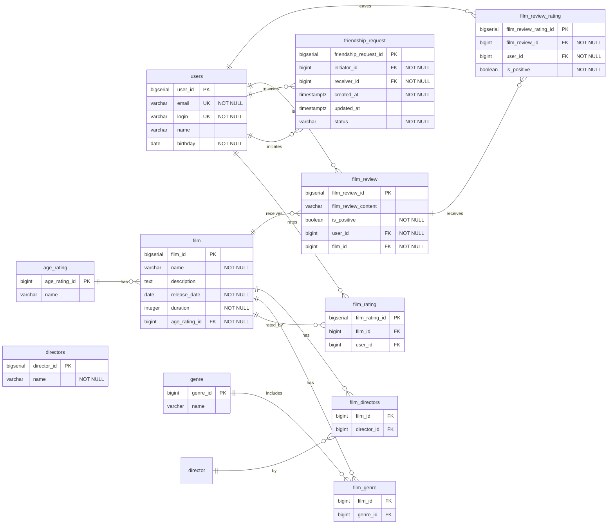

# java-filmorate

Template repository for Filmorate project.

# ER diagram

**Связи на диаграмме (1:N):**

На ER-диаграмме каждая линия — связь **один ко многим**. Так в реляционной БД обычно моделируют и прямые связи, и
разложение many-to-many через связующие таблицы.

| Связь                                      | Тип | Пояснение                                                                            |
|--------------------------------------------|-----|--------------------------------------------------------------------------------------|
| `users` → `film_rating`                    | 1:N | Пользователь может поставить лайк нескольким фильмам                                 |
| `film` → `film_rating`                     | 1:N | Фильм может получить лайки от нескольких пользователей                               |
| `users` → `friendship_request` (initiates) | 1:N | Пользователь может отправить несколько заявок в друзья                               |
| `users` → `friendship_request` (receives)  | 1:N | Пользователь может получить несколько заявок от других                               |
| `age_rating` → `film`                      | 1:N | Один возрастной рейтинг может быть у многих фильмов; у каждого фильма — один рейтинг |
| `film` → `film_genre`                      | 1:N | У фильма может быть несколько жанров                                                 |
| `genre` → `film_genre`                     | 1:N | Один жанр может относиться к многим фильмам                                          |
| `film` → `film_director`                   | 1:N | У фильма может быть несколько режиссёров                                             |
| `director` → `film_director`               | 1:N | Один режиссёр может относиться к многим фильмам                                      |
| `film` → `film_review`                     | 1:N | У фильма может быть несколько отзывов от разных пользователей                        |
| `users` → `film_review`                    | 1:N | У одного пользователя могут быть много отзывов на разные фильмы                      |
| `users` → `film_review_rating`             | 1:N | У одного пользователя могут быть много отзывов на разные отзывы о фильме             |

**Логические связи M:N:**

На уровне предметной области есть связи **многие-ко-многим**. В схеме они реализованы через связующие таблицы — каждая
такая связь раскладывается на **две** связи 1:N:

| Логическая связь                | Связующая таблица | Как читать                                                                          |
|---------------------------------|-------------------|-------------------------------------------------------------------------------------|
| `users` ↔ `film` (лайки)        | `film_rating`     | пользователь лайкает много фильмов, фильм получает лайки от многих пользователей    |
| `film` ↔ `genre` (жанры)        | `film_genre`      | у фильма может быть несколько жанров, один жанр относится ко многим фильмам         |
| `film` ↔ `director` (режиссёры) | `film_director`   | у фильма может быть несколько режиссёров, один режиссёр относится ко многим фильмам |

Используйте код с осторожностью.users ──1:N──► film_rating ◄──N:1── filmfilm ──1:N──► film_genre ◄──N:1── genrefilm ──1:
N──► film_director ◄──N:1── director Связь `users` ↔ `users` (дружба) **не является M:N напрямую**: она идёт через
`friendship_request`, где у каждой заявки есть один инициатор и один получатель.

**Ограничения уникальности:**

- `film_rating` — пара `(film_id, user_id)` уникальна (один лайк от пользователя на фильм)
- `friendship_request` — пара `(initiator_id, receiver_id)` уникальна (одна заявка между двумя пользователями)
- `film_genre` — пара `(film_id, genre_id)` уникальна (жанр не дублируется у одного фильма)
- `film_director` — пара `(film_id, director_id)` уникальна (режиссёр не дублируется у одного фильма)
- `film_review_rating` — пара `(film_review_id, user_id)` уникальна (одна оценка пользователя на отзыв)

**Справочники:**

| `genre_id` | `name`         |
|------------|----------------|
| 1          | Комедия        |
| 2          | Драма          |
| 3          | Мультфильм     |
| 4          | Триллер        |
| 5          | Документальный |
| 6          | Боевик         |

| `age_rating_id` | `name` |
|-----------------|--------|
| 1               | G      |
| 2               | PG     |
| 3               | PG-13  |
| 4               | R      |
| 5               | NC-17  |
