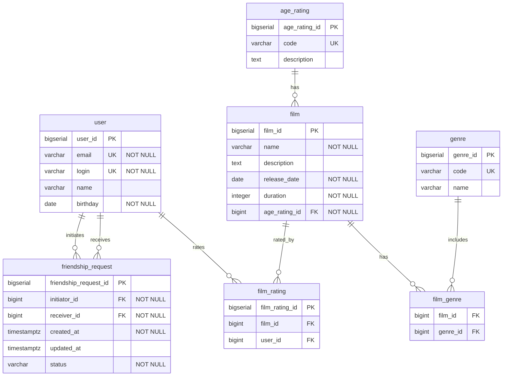

# java-filmorate

Template repository for Filmorate project.

# ER diagram



**Связи на диаграмме (1:N):**

На ER-диаграмме каждая линия — связь **один ко многим**. Так в реляционной БД обычно моделируют и прямые связи, и разложение many-to-many через связующие таблицы.

| Связь | Тип | Пояснение |
|---|---|---|
| `user` → `film_rating` | 1:N | Пользователь может поставить лайк нескольким фильмам |
| `film` → `film_rating` | 1:N | Фильм может получить лайки от нескольких пользователей |
| `user` → `friendship_request` (initiates) | 1:N | Пользователь может отправить несколько заявок в друзья |
| `user` → `friendship_request` (receives) | 1:N | Пользователь может получить несколько заявок от других |
| `age_rating` → `film` | 1:N | Один возрастной рейтинг может быть у многих фильмов; у каждого фильма — один рейтинг |
| `film` → `film_genre` | 1:N | У фильма может быть несколько жанров |
| `genre` → `film_genre` | 1:N | Один жанр может относиться к многим фильмам |

**Логические связи M:N:**

На уровне предметной области есть связи **многие-ко-многим**. В схеме они реализованы через связующие таблицы — каждая такая связь раскладывается на **две** связи 1:N:

| Логическая связь | Связующая таблица | Как читать |
|---|---|---|
| `user` ↔ `film` (лайки) | `film_rating` | пользователь лайкает много фильмов, фильм получает лайки от многих пользователей |
| `film` ↔ `genre` (жанры) | `film_genre` | у фильма может быть несколько жанров, один жанр относится ко многим фильмам |

```
user ──1:N──► film_rating ◄──N:1── film
film ──1:N──► film_genre ◄──N:1── genre
```

Связь `user` ↔ `user` (дружба) **не является M:N напрямую**: она идёт через `friendship_request`, где у каждой заявки есть один инициатор и один получатель.

**Ограничения уникальности:**

- `film_rating` — пара `(film_id, user_id)` уникальна (один лайк от пользователя на фильм)
- `friendship_request` — пара `(initiator_id, receiver_id)` уникальна (одна заявка между двумя пользователями)
- `film_genre` — пара `(film_id, genre_id)` уникальна (жанр не дублируется у одного фильма)

**Справочники:**

| `genre.code` | `genre.name`   |
|--------------|----------------|
| COMEDY       | Комедия        |
| DRAMA        | Драма          |
| ANIMATION    | Мультфильм     |
| THRILLER     | Триллер        |
| DOCUMENTARY  | Документальный |
| ACTION       | Боевик         |

| `age_rating.code` | `age_rating.description`                       |
|-------------------|------------------------------------------------|
| G                 | Нет возрастных ограничений                     |
| PG                | Детям рекомендуется смотреть с родителями      |
| PG-13             | Детям до 13 лет просмотр не желателен          |
| R                 | Лицам до 17 лет только в присутствии взрослого |
| NC-17             | Лицам до 18 лет просмотр запрещён              |

